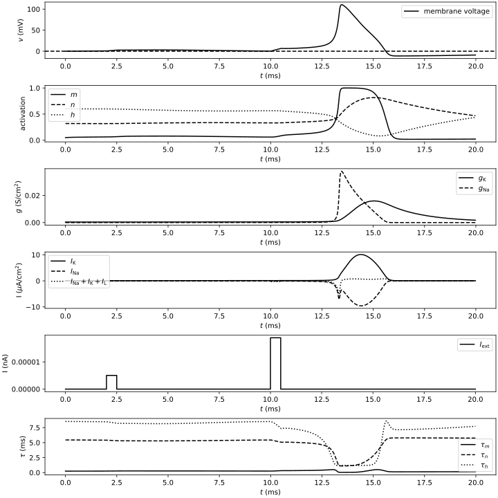

# Hodgkin-Huxley Approximated

Hodgkin-Huxley neuron simulation with approximations for gating variable steady-states and time constants.

Follows exercise 4, chapter 2 of Eugene M. Izhikevich: Dynamical Systems in Neuroscience

# Howto

```shell
virtualenv venv
source venv/bin/activate
pip install -r requirements.txt
```

Get `build-catalogue` from the Arbor source and modify the `Makefile` accordingly.

```shell
make
```

